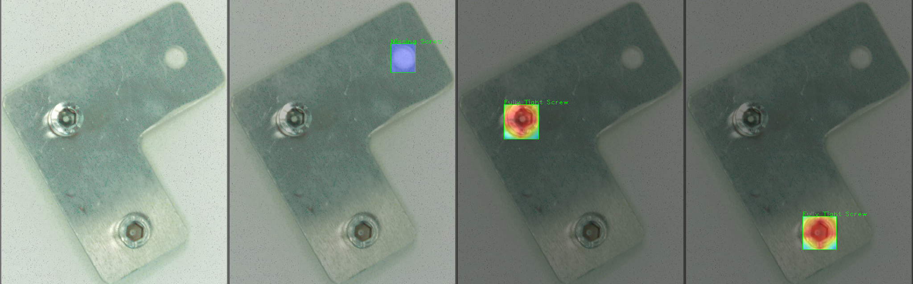

# Explainable AI for End-of-Line Inspection

This project explores the use of YOLOv8 for industrial defect detection,
combined with Explainable AI techniques to improve trust and transparency
in safety-critical production environments.

## 📊 XAI Visualization Gallery
These results demonstrate how the models identify screw defects in an industrial setting.

| LIME (YOLOv8) | Grad-CAM (VGG16) |
| :---: | :---: |
|! [LRP](methods_yolo/results/LRP4.png) |  |  |
| *Explaining "Loose Screw" detection* | *Heatmap for VGG Classification* |
