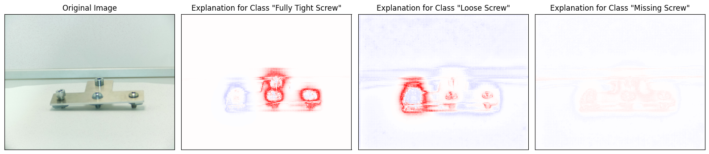
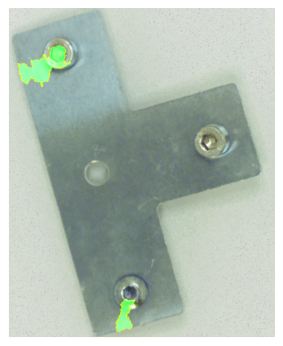

# Explainable AI for End-of-Line Inspection

This project explores the use of YOLOv8 for industrial defect detection,
combined with Explainable AI techniques to improve trust and transparency
in safety-critical production environments.

## 📊 XAI Visualization Results

### 1. LRP Explanation (YOLOv8)

*Figure 1: LRP heatmap showing feature importance for screw defect detection. Red areas indicate high influence on the model's decision.*

---

### 2. Grad-CAM Visualization (Yolov5)

*Figure 2: Grad-CAM output highlighting the convolutional layer activations during classification.*

---

### 3. LIME Visualization (Yolov8)

*Figure 3: LIME output highlighting the highlighting the areas important for classification.*
